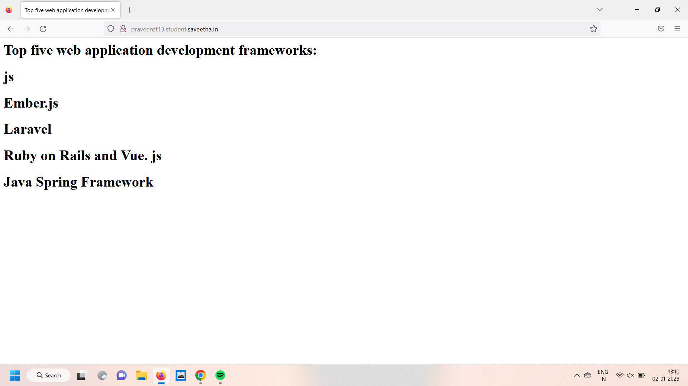

# Developing a Simple Webserver

# AIM:
NAME :PRAVEEN S
REFERENCE : 22009017

# DESIGN STEPS:

## Step 1:

HTML content creation is done

## Step 2:

Design of webserver workflow

## Step 3:

Implementation using Python code

## Step 4:

Serving the HTML pages.

## Step 5:

Testing the webserver

# PROGRAM:
```
from http.server import HTTPServer, BaseHTTPRequestHandler

content = """
<html>
<head>
</head>
<body>
<h1>Name: praveen s</h1>
<h1>reference no: 22009017 </h1>
</body>
</html>
"""
  
class myserver1(BaseHTTPRequestHandler):
    def do_GET(self):
        self.send_response(200)
        self.send_header("content-type", 'text/html; charset=utf-8')
        self.end_headers()
        self.wfile.write(content.encode())


Server_address =('',80)
httpd= HTTPServer(Server_address,myserver1)
httpd.serve_forever()
```


# OUTPUT:


# RESULT:

The program is executed succesfully
